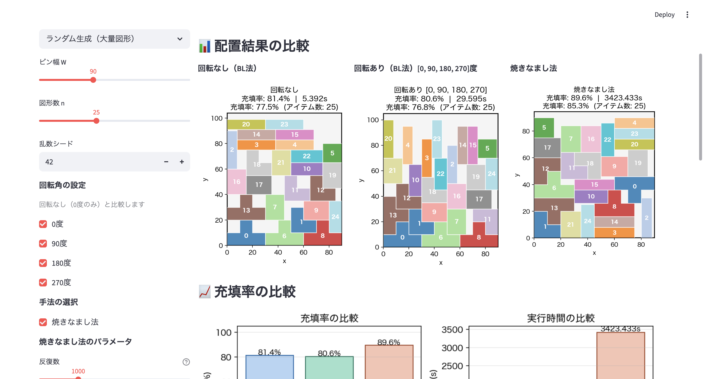

# 配置最適化アルゴリズム（2次元パッキング問題）

矩形・多角形の配置問題（2D Packing）に対して、複数のアルゴリズムを実装・比較した最適化プロジェクトです。

👉 **限られたスペースに対して効率的な配置を求める問題を解決できます。**


[](https://2d-packing-algorithms-r3lvpgajmvk2earrnhl3dk.streamlit.app/)


---

## 解決できる課題

- 限られたスペースにできるだけ多くの要素を配置したい
- 手動配置では最適解に近づけない
- レイアウト設計の効率を上げたい

---

## 想定ユースケース

- 工場設備の配置最適化
- 倉庫レイアウト設計
- 広告・UIのレイアウト最適化
- パッケージング・材料配置問題

---

## デモ
矩形・多角形のサイズ・個数を指定し、各アルゴリズムの配置結果を比較できます
### アプリ画面


### デモURL
Streamlit Cloud でインタラクティブデモを公開しています。  
→ **https://2d-packing-algorithms-r3lvpgajmvk2earrnhl3dk.streamlit.app/**

---

## 主な機能

- **複数アルゴリズムの比較**: BL法・NFP・焼きなまし法を実装
- **多角形パッキング対応**: 凸・非凸多角形、回転あり（0/90/180/270度）に対応
- **可視化による検証**: 配置結果を図として確認可能
- **性能比較（ベンチマーク）**: 実行時間・充填率を定量的に比較
- **インタラクティブ操作**: Streamlitによりパラメータ変更・結果確認が可能

---

## 実装アルゴリズム

### 矩形パッキング

| 手法 | 特徴 | 計算量 | ファイル |
|------|------|--------|---------|
| BL法（単純版） | 実装がシンプルだが計算量が大きい | O(n⁴) | `algorithms/bottom_left.py` |
| BL法（NFP版） | 幾何的処理により高速化 | O(n²logn) | `algorithms/nfp_bottom_left.py` |
| 焼きなまし法 | 確率的探索により高品質解を探索 | — | `algorithms/simulated_annealing.py` |

### 多角形パッキング

| 手法 | 特徴 | ファイル |
|------|------|---------|
| 多角形BL法 | 凸・非凸多角形対応、回転あり、NFPキャッシュによる高速化 | `algorithms/polygon_bl.py` |
| 多角形焼きなまし法 | 配置順序×回転角の組み合わせを焼きなまし法で最適化 | `algorithms/polygon_simulated_annealing.py` |

---

## ベンチマーク結果

### 単純版 vs NFP版（速度比較）

| n | 単純版 (s) | NFP版 (s) | 高速化倍率 |
|---|-----------|----------|-----------|
| 20 | 0.0100 | 0.0003 | 35x |
| 50 | 0.2928 | 0.0023 | 125x |
| 100 | 4.2966 | 0.0175 | 246x |

### BL法 vs 焼きなまし法（充填率比較）

10問の平均: BL法 **86.1%** → 焼きなまし法 **94.9%**（平均 **+8.8%** 改善）

### 多角形BL法 vs 多角形焼きなまし法（充填率比較）

ランダム生成25図形・ビン幅90の条件: BL法（回転なし）**81.4%** → 焼きなまし法 **89.6%**（**+8.2%** 改善）

---

## 関連記事

- [2次元パッキング問題におけるBottom-Left法とNFPを用いた高速化の実装](https://qiita.com/Haru8-8/items/438f87b89f065f29a6f4)
- [焼きなまし法による2次元パッキング問題の充填率改善](https://qiita.com/Haru8-8/items/cf04753edaa9f1ebec9e)
- [pyclipperを用いた多角形パッキング問題へのBL法の拡張と回転対応](https://qiita.com/Haru8-8/items/b474b5fcb93c6faacbef)
- [焼きなまし法による多角形パッキング問題の充填率改善（配置順序×回転角の最適化）](https://qiita.com/Haru8-8/items/16adef7bfce77662f3ea)

---

## 技術的なポイント

- **計算量改善の実装**: O(n⁴) → O(n²logn) への最適化
- **幾何アルゴリズムの応用（NFP）**: 複雑な配置制約を効率的に処理
- **メタヒューリスティクスの導入**: 焼きなまし法による近似最適解の探索
- **多角形パッキングへの拡張**: pyclipperのMinkowskiDiffを用いた多角形NFPの計算
- **NFPキャッシュ**: 全図形ペア×全回転角のNFPを事前計算して配置フェーズを高速化
- **可視化による検証**: アルゴリズムの挙動を視覚的に確認

---

## ファイル構成

```
packing/
├── app.py                           # Streamlit デモアプリ
├── requirements.txt                 # 依存ライブラリ
├── algorithms/
│   ├── bottom_left.py               # BL法（単純版 O(n^4)）
│   ├── nfp_bottom_left.py           # BL法（NFP版 O(n^2 log n)）
│   ├── simulated_annealing.py       # 焼きなまし法
│   ├── nfp_polygon.py               # 多角形NFP・IFRの計算とキャッシュ管理
│   ├── polygon_bl.py                # 多角形BL法（凸・非凸・回転対応）
│   └── polygon_simulated_annealing.py # 多角形焼きなまし法（配置順序×回転角の最適化）
├── utils/
│   └── visualizer.py                # matplotlib 可視化ユーティリティ
└── notebooks/
    ├── 01_bottom_left.ipynb         # BL法の復習・動作確認
    ├── 02_nfp_bottom_left.ipynb     # NFP実装・速度比較ベンチマーク
    ├── 03_simulated_annealing.ipynb # 焼きなまし法・収束確認
    ├── 04_polygon_bl.ipynb          # 多角形BL法の動作確認
    └── 05_polygon_simulated_annealing.ipynb # 多角形焼きなまし法の動作確認
```

---

## ローカルで実行

```bash
pip install -r requirements.txt
streamlit run app.py
```

---

## 備考

最適化アルゴリズムの理解・検証を目的として実装したプロジェクトです。実務での配置最適化問題への応用も想定しています。

---

## ライセンス

[MIT License](LICENSE)

---

## 参考文献

- 今堀慎治 他, "Python による図形詰込みアルゴリズム入門", オペレーションズ・リサーチ, 63(12), pp.762-769, 2018.
- 川島大貴 他, "3次元パッキングに対する効率的な bottom-left", 数理解析研究所講究録, 1726, pp.50-61, 2011.
- Imamichi et al., "An iterated local search algorithm based on nonlinear programming for the irregular strip packing problem", Technical Report 2007-009, Kyoto University, 2007.